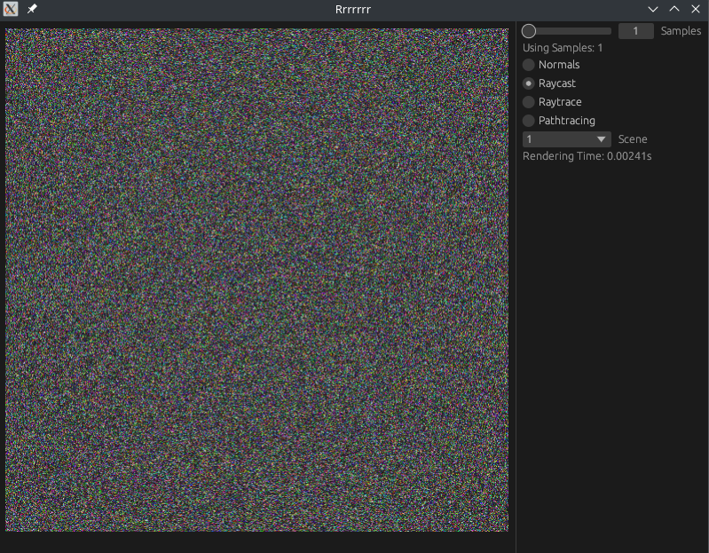

# egui-pixelmap-template

A focused Rust template for displaying an RGBA pixel buffer in a desktop window using eframe/egui. It features a square,
auto-fitting canvas and a compact control panel for tweaking parameters while showing live frame time. Ideal for
CPU-generated image workflows: ray/path tracers, rasterizers, image filters, and procedural textures.

## Features

- Display a Vec<u8> RGBA buffer each frame as a texture
- Example Controls for sample count, render mode, and scene selection
- Automatic square viewport sizing
- Live render time for quick performance feedback

## Use cases

- Visualizing software renderers and image pipelines
- Rapid prototyping of pixel-based experiments
- Teaching/demoing rendering concepts

## Run

- `cargo run`
- Replace the pixel-generation logic with your own renderer or image source.

